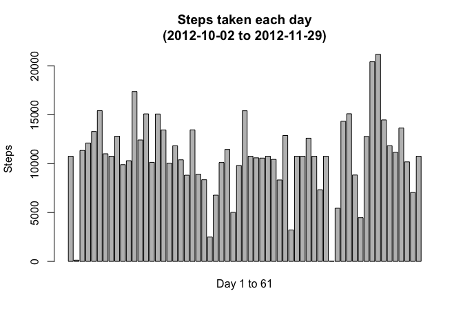

# Reproducible Research: Peer Assessment 1


## Loading and preprocessing the data


```r
activity_data = read.csv("activity.csv")
activity_data$date = as.Date(activity_data$date, "%Y-%m-%d")
```


## What is mean total number of steps taken per day?

```r
barplot(tapply(activity_data[complete.cases(activity_data),1], activity_data[complete.cases(activity_data),2], sum), xaxt="n",
        ylab = "Steps", main = "Steps taken each day\n(2012-10-02 to 2012-11-29)")
mtext(side=1, text="Day 1 to 61\n(excluding day: 1,8,32,35,40,41,45,61)", line=1)
```

<!-- -->

```r
options("scipen" = 10)
mean = round(mean(tapply(activity_data$steps, activity_data$date, sum), na.rm = T),10)
median = median(tapply(activity_data$steps, activity_data$date, sum), na.rm = T)
```

mean =  10766.1886792

median =  10765

## What is the average daily activity pattern?

```r
minute = names(which.max(tapply(activity_data[complete.cases(activity_data),1], activity_data[complete.cases(activity_data),3], mean)))
index = which.max(unname(tapply(activity_data[complete.cases(activity_data),1], activity_data[complete.cases(activity_data),3], mean)))
```
The 104th (835 minute) interval contains the maximum number of steps, averaged across all the days.


## Imputing missing values

```r
NA_row = unname(table(complete.cases(activity_data))[1])
```
There are 2304 rows with NAs.


```r
#First find days which measurment never took place.
missing_day = tapply(activity_data$steps, activity_data$interval, function(x)which(is.na(x)))
missing_days = unique(activity_data$date)[missing_day[[1]]]

#Find averge for each interval (over entire study period)
average_4_intervals = unname(tapply(activity_data[complete.cases(activity_data),1], activity_data[complete.cases(activity_data),3], mean))

#impute missing stpes with average step of that particular interval 
for (day in missing_days){
        activity_data$steps[which(activity_data$date == day)] = average_4_intervals
}
print(head(activity_data))

mean = mean(tapply(activity_data$steps, activity_data$date, sum), na.rm = T)
median = median(tapply(activity_data$steps, activity_data$date, sum), na.rm = T)

barplot(tapply(activity_data[,1], activity_data[,2], sum), xaxt="n",
        ylab = "Steps", main = "Steps taken each day\n(2012-10-02 to 2012-11-29)")
mtext(side=1, text="Day 1 to 61", line=1)
```

<!-- -->

mean = 10766.1886792

median = 10766.1886792

The means stays the same, the meandin is slightly higher.


## Are there differences in activity patterns between weekdays and weekends?

```r
activity_data$`day of the week` <- ifelse(weekdays(activity_data$date) %in% c("Saturday", "Sunday"), "Weekend", "Weekday")
activity_data$`day of the week` = as.factor(activity_data$`day of the week`)

library(lattice)
weekday = data.frame(Steps = with(activity_data[activity_data$`day of the week`=='Weekday',], unname(tapply(steps, interval, mean))), Interval = unique(activity_data$interval), day = "Weekday")
weekend = data.frame(Steps = with(activity_data[activity_data$`day of the week`=='Weekend',], unname(tapply(steps, interval, mean))), Interval = unique(activity_data$interval), day = "Weekend")
combined = rbind(weekday, weekend)
xyplot(Steps~Interval | day, data = combined, type = "l", layout = c(1, 2)
)
```

<!-- -->
